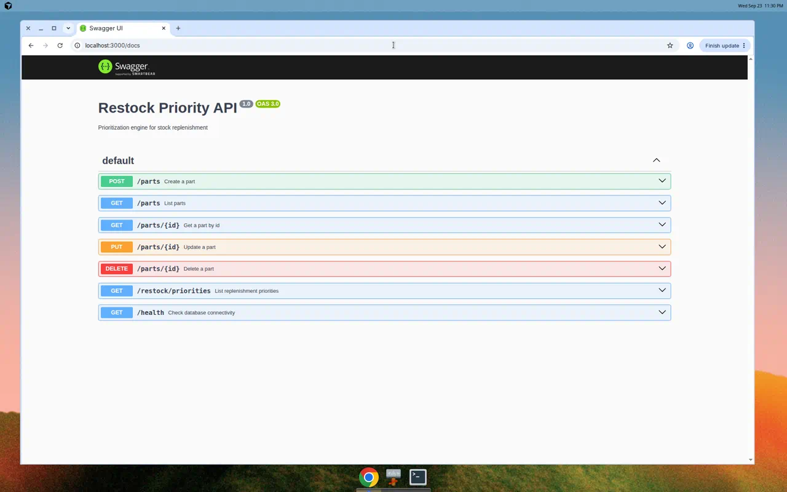
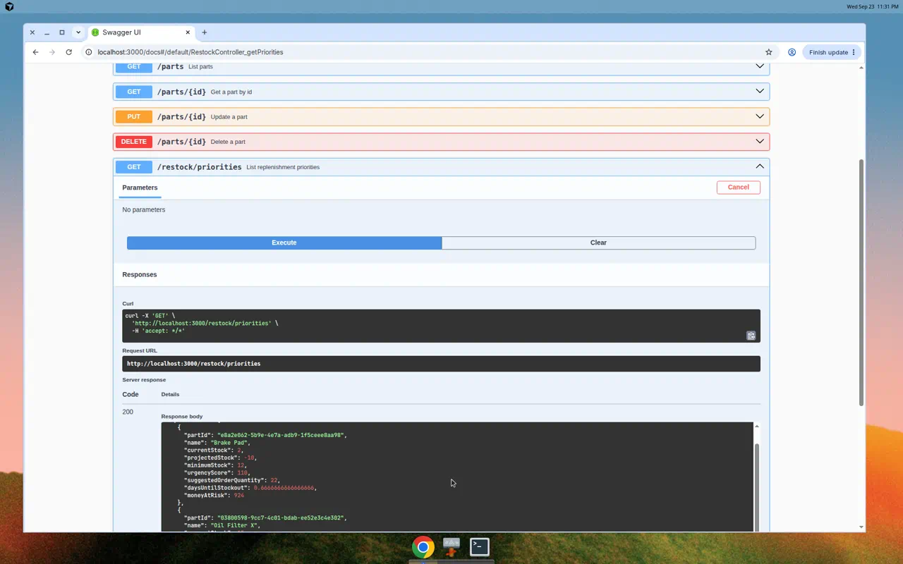
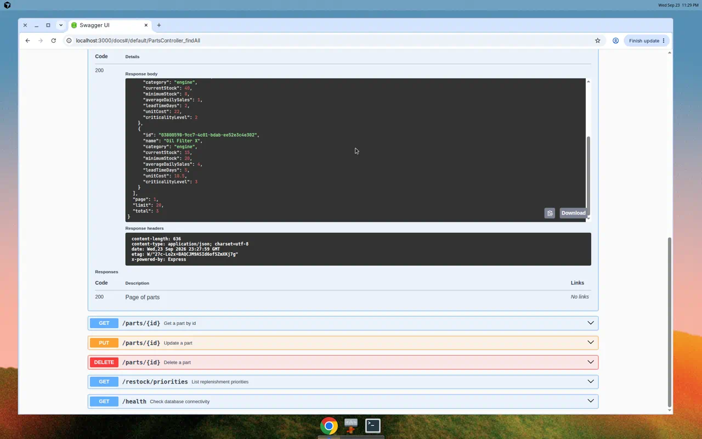

# restock-priority

[Português](README.pt-BR.md)

[](https://github.com/victor-dias-dev/test-karhub/actions/workflows/ci.yml)
[](LICENSE)

Stock replenishment for parts: who to buy first, how many units, and how much money is at risk while the order is in transit.

Criticality decides who jumps the queue. Unit cost is reported as money at risk so a buyer can override that order. It does not change the sort. The ranking rule lives in [`packages/restock-priority`](packages/restock-priority) and does not import NestJS or Prisma.





## What is in the app

- Parts: create, list, fetch, update, and delete
- Paginated `GET /parts` (`page`, `limit` up to 100, optional `category`)
- `GET /restock/priorities` for every part that falls below its minimum during the lead time
- Suggested order quantity, days until stockout, and money at risk
- `GET /health` against PostgreSQL
- OpenAPI at `/docs`

## Requirements

- Node.js 20+
- npm 10+
- Docker and Docker Compose

PostgreSQL 16 is required. The schema uses `gen_random_uuid()` and `@db.Uuid`.

## Quick start

```bash
npm install
cp .env.example .env
docker compose up -d db
npx prisma migrate dev
npm run start:dev
```

`npm install` builds the engine. The API listens on http://localhost:3000. Swagger: http://localhost:3000/docs. Health: `GET /health`.

To run the API and PostgreSQL together: `docker compose up --build`.

The API reads `PORT` and `DATABASE_URL` from the environment. Copy `.env.example` and keep real secrets out of git.

| Variable       | Purpose                          |
| -------------- | -------------------------------- |
| `PORT`         | HTTP port. Defaults to `3000`    |
| `DATABASE_URL` | PostgreSQL connection string     |

## Checks

```bash
npm test
npm run test:e2e
npm run lint
npm run build
```

End-to-end tests need PostgreSQL and `DATABASE_URL`. The value in `.env.example` matches the Compose database. Coverage: `npm run test:cov`.

## Repository

```text
packages/restock-priority   Publishable ranking engine
src/modules/parts           Parts CRUD
src/modules/restock         GET /restock/priorities
src/modules/health          GET /health
```

Expected consumption is `averageDailySales * leadTimeDays`. Projected stock is `currentStock - expectedConsumption`. A part needs replenishment when projected stock is below `minimumStock`.

Urgency score is `(minimumStock - projectedStock) * criticalityLevel`. Suggested order quantity is `ceil(minimumStock - projectedStock)`. Days until stockout is `currentStock / averageDailySales`, or `null` when daily sales are 0. Money at risk is `(minimumStock - projectedStock) * unitCost`.

Ties break by higher criticality, then higher average daily sales, then name ascending.

Worked example: stock 15, minimum 20, daily sales 4, lead time 5, unit cost 18.50, criticality 3. Projected stock is -5, the score is 75, the suggested order is 25, days until stockout is 3.75, and money at risk is 462.50.

## Contributing

See [CONTRIBUTING.md](CONTRIBUTING.md). Security reports are described in [SECURITY.md](SECURITY.md).

Licensed under the [MIT License](LICENSE).
